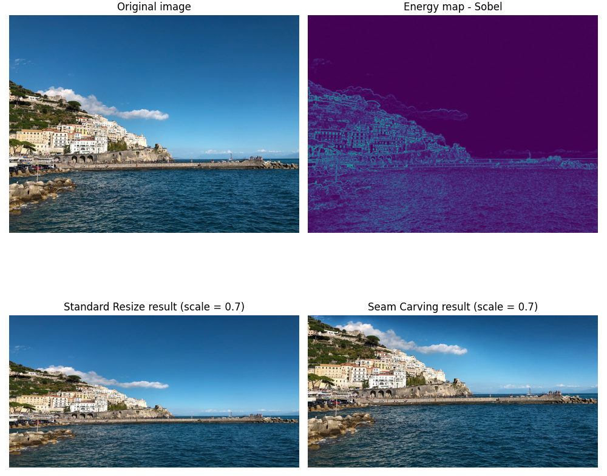

# Seam Carving

## Description

Content-Aware Scaling using Seam Carving method with different algorithms for energy mapping.



The implementation is similar to the 'Content-Aware Scale' tool present in Adobe Photoshop, which is also based in the Seam Carving method:


Quick reference: https://en.wikipedia.org/wiki/Seam_carving

Demo: https://www.aryan.app/seam-carving/

## Context & Environment

The program was developed and tested on macOS 10.15.6. The same bash commands should work on a machine running a unix-based OS (e.g., Ubuntu).

On a Windows machine, the required packages can be easily installed using [Anaconda](https://www.anaconda.com/). Afterwards, the program can be executed using PowerShell launched by Anaconda Navigator.

## Installation

It is recommended to use the program in a virtual environment. To create a virtual environment, the virtualenv package has to be installed:

```console
foo@bar ~ % python3 -m pip install virtualenv
```

After that, navigate to the folder where the 'src' folder for the scripts is located. Then we can create the virtual environment using the following command:

```console
foo@bar ~ % python3 -m venv env
```

You'll notice that the 'env' folder was created in your workspace. Now we need to activate the environment:

```console
foo@bar ~ % source env/bin/activate
```

To install the required packages, use the following command:

```console
foo@bar ~ % python3 -m pip install -r requirements.txt
```

To leave the virtual environment, just run the following command:

```console
foo@bar ~ % deactivate
```

## Usage

First, navigate to your workspace folder where the 'src', 'images' folders are located. Then, activate your virtual environment created in the 'Installation' section:

```console
foo@bar ~ % source env/bin/activate
```

Once in the virtual environment, open the 'src' folder:

```console
foo@bar ~ % cd src
```

Now you can run the program using the following command:
```console
foo@bar src % python3 sc.py -in <image filename (in /images/ folder)> -scale <downsizing scale> -seam <seam orientation, v for vertical h for horizontal> -energy <energy algorithm (e.g. s for sobel)>
```

As for example:

```console
foo@bar src % python3 sc.py -in image.jpg -scale 0.5 -seam h -energy s
```

In case you need help with the parameters, just run the command below:

```console
foo@bar src % python3 sc.py -h
usage: sc.py [-h] -in IN -scale SCALE -seam SEAM [-energy ENERGY] [-plot] [-metrics]

optional arguments:
  -h, --help      show this help message and exit
  -in IN          Path to input image
  -scale SCALE    Downsizing scale. e.g. 0.5
  -seam SEAM      Seam orientation (h = horizontal seam, v = vertical seam)
  -energy ENERGY  Energy mapping algorithm (s = Sobel, p = Prewitt, l =
                  Laplacian, r = Roberts, c = Canny, f = Forward energy)
  -plot           Plot result after resizing
  -metrics        Save metrics in a .csv file
```

## License
[MIT](https://choosealicense.com/licenses/mit/)
